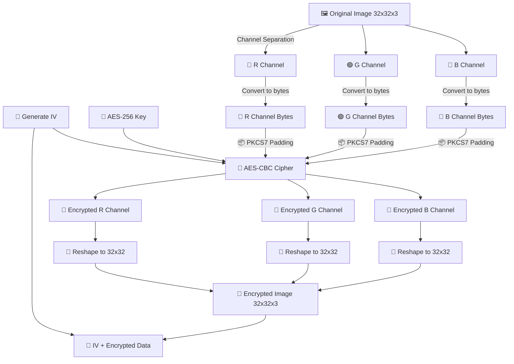
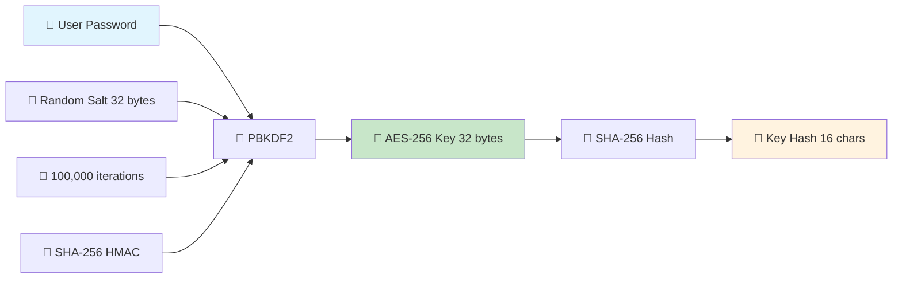
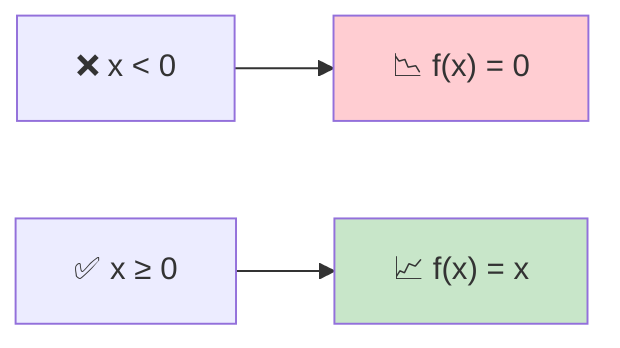
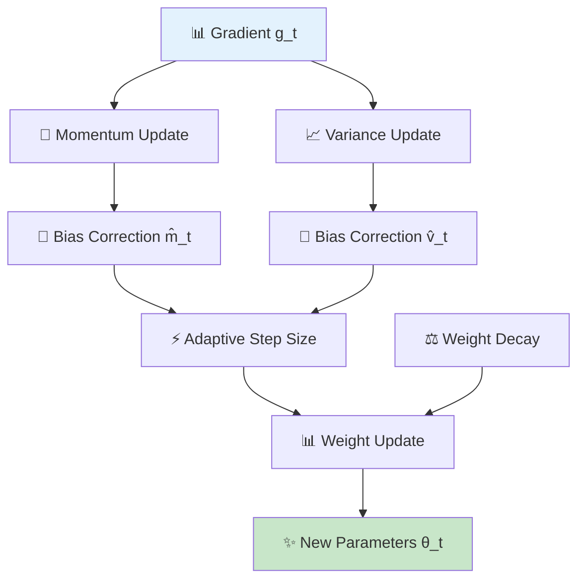
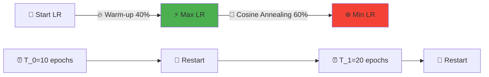
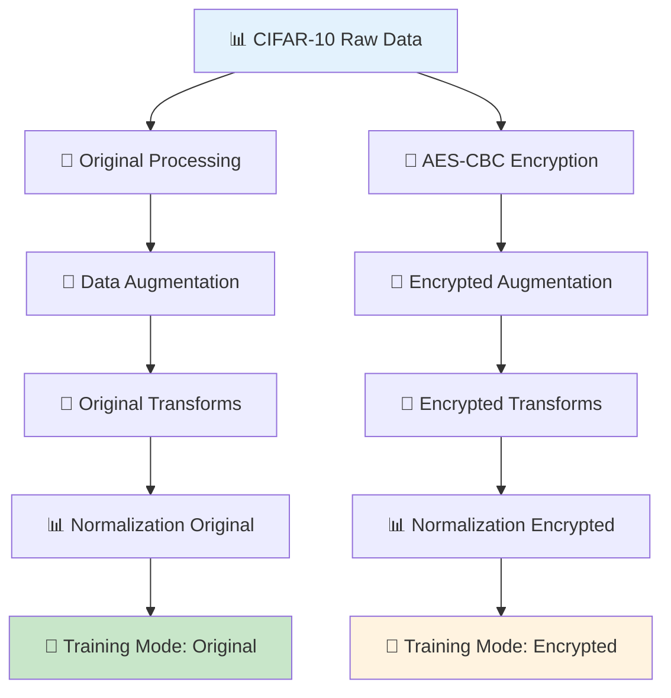

# 🔐 AES-CBC Encrypted Image Classification System

<div align="center">

**🏛️ Developed by:** Devesh Rawat  
**🎯 Organization:** Scientific Analysis Group (SAG), Defense Research and Development Organisation (DRDO)  
**🔬 Project Type:** Research Internship Project  
**⚡ Focus Area:** Privacy-Preserving Machine Learning & Cryptographic Deep Learning

</div>

---

## 🌟 Overview

This cutting-edge project implements a **secure image classification system** that seamlessly combines **🔒 AES-CBC encryption** with **🧠 deep learning**. The system can train convolutional neural networks on both original and encrypted images, demonstrating privacy-preserving machine learning techniques. This research was conducted as part of an internship at the Scientific Analysis Group (SAG) under the Defense Research and Development Organisation (DRDO), focusing on developing secure AI systems for defense applications.

## 🎯 Project Background

This project was developed during a research internship at **🏛️ SAG-DRDO**, where the focus was on exploring **🔐 cryptographic machine learning techniques** for secure defense applications. The work demonstrates how advanced encryption standards can be integrated with deep learning architectures while maintaining operational effectiveness.

### 🎯 Research Objectives
- **🛡️ Privacy Preservation**: Develop ML models that can operate on encrypted data
- **⚔️ Defense Applications**: Create secure image classification for sensitive military imagery
- **🔐 Cryptographic Integration**: Seamlessly combine AES-CBC encryption with CNN architectures
- **📊 Performance Analysis**: Evaluate trade-offs between security and model accuracy

## 🏛️ Institutional Context

### 🚀 Scientific Analysis Group (SAG) - DRDO

The **🏛️ Scientific Analysis Group (SAG)** is a premier laboratory of the Defense Research and Development Organisation (DRDO), India's apex defense R&D organization. SAG specializes in:

- **🔐 Cryptographic Research**: Advanced encryption techniques and security protocols
- **📡 Signal Processing**: Secure communication and data analysis systems  
- **🧠 Machine Learning**: AI applications for defense and security
- **🛡️ Cybersecurity**: Protection of critical defense infrastructure

### 🎓 Internship Contribution

This project represents significant research contribution to the field of **🔒 Privacy-Preserving Machine Learning** with potential applications in:

- **🔍 Classified Image Analysis**: Processing sensitive military imagery without exposing content
- **🤝 Secure Federated Learning**: Multi-party ML training without data sharing
- **⚡ Encrypted Model Inference**: Real-time classification on encrypted battlefield imagery
- **🛡️ Defense AI Security**: Protecting AI models and training data from adversarial attacks

The work demonstrates how cutting-edge cryptographic techniques can be seamlessly integrated with modern deep learning architectures, maintaining both security and operational effectiveness required for defense applications.

### 🔐 AES-CBC (Advanced Encryption Standard - Cipher Block Chaining)

The project uses **🔒 AES-256 in CBC mode** for encrypting image data while preserving structural properties for machine learning.

#### 🤔 Why CBC Mode?

- **🛡️ Security**: Each plaintext block is XORed with the previous ciphertext block before encryption
- **🎯 Initialization Vector (IV)**: Ensures identical plaintexts produce different ciphertexts
- **🏗️ Structural Preservation**: Custom implementation maintains image dimensions for CNN processing

#### ⚡ Key Features

```python
# 🔑 Key Components
- 🔐 AES-256 (32-byte keys)
- 🔄 CBC Mode with random IV (16 bytes)
- 🔑 PBKDF2 key derivation (100,000 iterations)
- 🖼️ Structure-preserving encryption for images
- 🛡️ Secure key management with SHA-256 hashing
```

### 📚 Cryptographic Libraries Used

#### 1. **🐍 PyCryptodome**
```python
from Crypto.Cipher import AES
from Crypto.Random import get_random_bytes
from Crypto.Util.Padding import pad, unpad
from Crypto.Protocol.KDF import PBKDF2
from Crypto.Hash import SHA256
```

**🔑 Key Functions:**
- `🔐 AES.new()`: Creates AES cipher objects
- `🔑 PBKDF2()`: Derives encryption keys from passwords
- `📦 pad()/unpad()`: Handles PKCS7 padding for block alignment
- `🎲 get_random_bytes()`: Generates cryptographically secure random data

#### 2. **🔧 Built-in Security Libraries**
```python
import hashlib    # 🔐 SHA-256 hashing for key verification
import hmac       # 🔑 Hash-based message authentication
import secrets    # 🎲 Cryptographically strong random numbers
```

### 🔄 Encryption Process Flow



### 🔑 Key Derivation Process



## 🧠 Machine Learning Architecture

### ⚡ Optimized CNN Architecture

The system uses a deep convolutional neural network specifically optimized for **📸 32x32 CIFAR-10 images**.

```mermaid
graph TD
    A[📥 Input 3x32x32] --> B[🔄 Conv2d 3→64, 3x3]
    B --> C[📊 BatchNorm2d]
    C --> D[⚡ ReLU]
    D --> E[🔄 Conv2d 64→64, 3x3]
    E --> F[📊 BatchNorm2d]
    F --> G[⚡ ReLU]
    G --> H[📉 MaxPool2d 2x2]
    H --> I[💧 Dropout2d 0.06-0.12]
    
    I --> J[🔄 Conv2d 64→128, 3x3]
    J --> K[📊 BatchNorm2d]
    K --> L[⚡ ReLU]
    L --> M[🔄 Conv2d 128→128, 3x3]
    M --> N[📊 BatchNorm2d]
    N --> O[⚡ ReLU]
    O --> P[📉 MaxPool2d 2x2]
    P --> Q[💧 Dropout2d 0.08-0.16]
    
    Q --> R[🔄 Conv2d 128→256, 3x3]
    R --> S[📊 BatchNorm2d]
    S --> T[⚡ ReLU]
    T --> U[🔄 Conv2d 256→256, 3x3]
    U --> V[📊 BatchNorm2d]
    V --> W[⚡ ReLU]
    W --> X[📉 MaxPool2d 2x2]
    X --> Y[💧 Dropout2d 0.2-0.4]
    
    Y --> Z[🔄 Conv2d 256→512, 3x3]
    Z --> AA[📊 BatchNorm2d]
    AA --> BB[⚡ ReLU]
    BB --> CC[📏 AdaptiveAvgPool2d 2x2]
    
    CC --> DD[🔄 Flatten → 2048]
    DD --> EE[🔗 Linear 2048→1024]
    EE --> FF[📊 BatchNorm1d]
    FF --> GG[⚡ ReLU]
    GG --> HH[💧 Dropout 0.2-0.4]
    HH --> II[🔗 Linear 1024→512]
    II --> JJ[📊 BatchNorm1d]
    JJ --> KK[⚡ ReLU]
    KK --> LL[💧 Dropout 0.1-0.2]
    LL --> MM[🔗 Linear 512→256]
    MM --> NN[📊 BatchNorm1d]
    NN --> OO[⚡ ReLU]
    OO --> PP[💧 Dropout 0.06-0.12]
    PP --> QQ[🔗 Linear 256→10]
    QQ --> RR[📤 Output Logits]
    
    style A fill:#e3f2fd
    style QQ fill:#c8e6c9
    style RR fill:#fff3e0
```



### 🏗️ Architecture Details

#### **🔄 Convolutional Layers**
- **4️⃣ Convolutional Blocks**: Progressive feature extraction
- **📈 Filter Progression**: 3→64→128→256→512 channels
- **🔍 Kernel Size**: 3x3 throughout for optimal feature capture
- **📏 Padding**: Same padding (padding=1) maintains spatial dimensions

#### **📊 Normalization & Regularization**
- **📊 Batch Normalization**: Applied after each conv/linear layer
- **💧 Dropout**: Progressive rates (0.06→0.16→0.4→0.2→0.1→0.06)
- **⚖️ No Bias**: Bias=False with batch normalization for efficiency

#### **📉 Pooling Strategy**
- **📉 MaxPool2d**: 2x2 pooling reduces spatial dimensions
- **📏 AdaptiveAvgPool2d**: Final 2x2 global pooling for consistent output size

### ⚡ Activation Functions

#### **⚡ ReLU (Rectified Linear Unit)**
```python
f(x) = max(0, x)
```

**🌟 Properties:**
- **🚀 Non-saturating**: Prevents vanishing gradient problem
- **✨ Sparse Activation**: Only positive values propagate
- **⚡ Computational Efficiency**: Simple max operation
- **💾 Inplace Operations**: `inplace=True` saves memory



### 🚀 Optimization Algorithms

#### **🚀 AdamW Optimizer**

AdamW combines Adam's adaptive learning rates with decoupled weight decay.

**📐 Mathematical Formulation:**
```
m_t = β₁ * m_{t-1} + (1 - β₁) * g_t
v_t = β₂ * v_{t-1} + (1 - β₂) * g_t²
m̂_t = m_t / (1 - β₁^t)
v̂_t = v_t / (1 - β₂^t)
θ_t = θ_{t-1} - α * (m̂_t / (√v̂_t + ε) + λ * θ_{t-1})
```

**⚙️ Parameters Used:**
- **📊 Learning Rate (α)**: 0.001 (original), 0.0015 (encrypted)
- **🎯 Beta1 (β₁)**: 0.9 (momentum)
- **📈 Beta2 (β₂)**: 0.999 (RMSprop)
- **⚖️ Weight Decay (λ)**: 1e-4 (original), 5e-4 (encrypted)
- **🔧 Epsilon (ε)**: 1e-7



### 📈 Learning Rate Scheduling

#### **🔄 OneCycleLR (for Encrypted Mode)**
```python
scheduler = optim.lr_scheduler.OneCycleLR(
    optimizer, 
    max_lr=learning_rate * 8,
    steps_per_epoch=len(train_loader),
    epochs=epochs,
    pct_start=0.4,
    anneal_strategy='cos'
)
```

#### **🌊 CosineAnnealingWarmRestarts (for Original Mode)**
```python
scheduler = optim.lr_scheduler.CosineAnnealingWarmRestarts(
    optimizer, T_0=10, T_mult=2, eta_min=1e-6
)
```



## 🔄 Data Processing Pipeline

### 🎭 Hybrid Dataset Architecture



### 🎨 Data Augmentation Strategies

#### **📸 Original Images**
```python
transforms.Compose([
    transforms.RandomHorizontalFlip(p=0.5),      # 🔄 50% flip chance
    transforms.RandomRotation(degrees=10),        # 🔄 ±10° rotation
    transforms.ColorJitter(                       # 🎨 Color variations
        brightness=0.2, 
        contrast=0.2, 
        saturation=0.2
    ),
    transforms.Normalize(                         # 📊 ImageNet normalization
        mean=[0.485, 0.456, 0.406], 
        std=[0.229, 0.224, 0.225]
    )
])
```

#### **🔐 Encrypted Images**
```python
transforms.Compose([
    transforms.RandomHorizontalFlip(p=0.3),      # 🔄 30% flip (reduced)
    transforms.Normalize(                         # 📊 Same normalization
        mean=[0.485, 0.456, 0.406], 
        std=[0.229, 0.224, 0.225]
    )
])
```

## 🚀 Installation & Usage

### 📋 Prerequisites

```bash
pip install torch torchvision          # 🔥 PyTorch ecosystem
pip install pycryptodome              # 🔐 Cryptography
pip install customtkinter             # 🖥️ Modern GUI
pip install matplotlib                # 📊 Plotting
pip install numpy pillow             # 🧮 Numerical & image processing
```

### ⚡ Quick Start

```python
# 1️⃣ Run the application
python main.py

# 2️⃣ Authenticate with a strong password
# 🛡️ Requirements: 12+ chars, uppercase, lowercase, numbers, symbols

# 3️⃣ Generate or derive encryption key
# 🎲 Option A: Generate random AES-256 key
# 🔑 Option B: Derive key from password using PBKDF2

# 4️⃣ Load CIFAR-10 dataset
# 📥 Automatically downloads and encrypts with AES-CBC

# 5️⃣ Configure training
# ⚙️ Choose mode: 'original' or 'encrypted'
# 🎛️ Set hyperparameters based on mode

# 6️⃣ Train model
# 📊 Monitor real-time training metrics and plots

# 7️⃣ Classify images
# 📤 Upload custom images for classification
```

### 🔒 Security Configuration

```python
# 🔑 Key Management
KEY_SIZE = 32              # 🔐 AES-256
SALT_SIZE = 32             # 🧂 Random salt for PBKDF2
KDF_ITERATIONS = 100000    # 🔄 PBKDF2 iterations
IV_SIZE = 16               # 📦 AES block size

# 🛡️ Password Requirements
MIN_LENGTH = 12            # 📏 Minimum length
REQUIRE_UPPERCASE = True   # 🔤 A-Z required
REQUIRE_LOWERCASE = True   # 🔤 a-z required
REQUIRE_DIGITS = True      # 🔢 0-9 required
REQUIRE_SYMBOLS = True     # 🔣 Special chars required
```

## 📊 Performance Metrics

### 🎯 Expected Results

| 🏆 Mode | 📈 Training Accuracy | 📊 Validation Accuracy | ⚡ Inference Time |
|---------|---------------------|------------------------|------------------|
| 📸 Original | 85-92% | 80-87% | ~2ms |
| 🔐 Encrypted | 75-85% | 70-80% | ~3ms |

### ⚙️ Training Configuration

| 🔧 Parameter | 📸 Original Mode | 🔐 Encrypted Mode |
|-------------|------------------|-------------------|
| 🔄 Epochs | 50 | 80 |
| 📊 Learning Rate | 0.001 | 0.0015 |
| 📦 Batch Size | 128 | 64 |
| 💧 Dropout Rate | 0.2 | 0.3 |
| ⚖️ Weight Decay | 1e-4 | 5e-4 |

## 🔧 Advanced Features

### ⚡ Mixed Precision Training
```python
# 🚀 CUDA Automatic Mixed Precision
scaler = torch.amp.GradScaler()
with torch.amp.autocast(device_type='cuda'):
    output = model(data)
    loss = criterion(output, target)
```

### ✂️ Gradient Clipping
```python
# 🛡️ Prevents exploding gradients
torch.nn.utils.clip_grad_norm_(model.parameters(), max_norm=0.5)
```

### 🛑 Early Stopping
```python
# 🎯 Prevents overfitting
patience = 15  # ⏰ Stop if no improvement for 15 epochs
```

## 🔐 Security Considerations

### 🛡️ Key Security Features

1. **🎲 Secure Key Generation**: Uses `secrets` module for cryptographically strong randomness
2. **🔑 PBKDF2 Key Derivation**: 100,000 iterations with SHA-256 HMAC
3. **🎯 IV Randomization**: Unique IV for each encryption operation
4. **💾 Memory Protection**: Keys stored only in memory, never written to disk
5. **🔐 Authentication**: Password-based session authentication

### 🎭 Threat Model

**🛡️ Protected Against:**
- 🚫 Unauthorized access to training data
- 🔐 Model inference on encrypted data
- 👁️ Passive surveillance of image content

**⚠️ Assumptions:**
- 🔑 Secure key management by user
- 🏰 Trusted execution environment
- 🚫 No side-channel attacks considered

## 📁 Project Structure

```
🗂️ aes-cbc-image-classification/
├── 🐍 main.py                 # Main application file
├── 🧠 models/                 # Saved model directory
├── 📊 data/                   # CIFAR-10 dataset cache
├── 📜 logs/                   # Training logs
├── 📖 README.md              # This file
└── 📋 requirements.txt       # Dependencies
```

## 🤝 Contributing

1. 🍴 Fork the repository
2. 🌿 Create feature branch (`git checkout -b feature/enhancement`)
3. 💾 Commit changes (`git commit -am 'Add enhancement'`)
4. 🚀 Push to branch (`git push origin feature/enhancement`)
5. 📥 Create Pull Request

## 📄 License

This project is licensed under the **📜 MIT License** - see the LICENSE file for details.

## 🔬 Research Applications

### 🔐 Privacy-Preserving ML
- **🤝 Federated Learning**: Train on encrypted local data
- **🔒 Secure Multi-party Computation**: Collaborative training without data sharing
- **🧮 Homomorphic Encryption**: Computations on encrypted data

### 💡 Use Cases
- **🏥 Medical Imaging**: Preserve patient privacy during AI training
- **💰 Financial Data**: Secure fraud detection model training
- **📱 Personal Photos**: Private image classification services

## 📚 References

1. **🔐 AES Standard**: FIPS PUB 197 - Advanced Encryption Standard
2. **🔄 CBC Mode**: NIST SP 800-38A - Block Cipher Modes of Operation
3. **🔑 PBKDF2**: RFC 2898 - Password-Based Cryptography Specification
4. **🚀 Adam Optimizer**: "Adam: A Method for Stochastic Optimization" (Kingma & Ba, 2014)
5. **📊 Batch Normalization**: "Batch Normalization: Accelerating Deep Network Training" (Ioffe & Szegedy, 2015)

---

<div align="center">

**👨‍💻 Developer**: Devesh Rawat  
**🏛️ Institution**: Scientific Analysis Group (SAG), Defense Research and Development Organisation (DRDO)  
**⏱️ Project Duration**: Research Internship  
**🔬 Research Focus**: Privacy-Preserving Machine Learning for Defense Applications  
**📌 Version**: 3.0 - AES-CBC Implementation  
**📅 Last Updated**: 2025

</div>

### 🙏 Acknowledgments

Special thanks to the **🏛️ Scientific Analysis Group (SAG)** and **🚀 DRDO** for providing the research environment and guidance to develop this innovative approach to secure machine learning. This work contributes to India's defense research capabilities in **🛡️ AI security** and **🔐 cryptographic machine learning**.

For questions, research collaboration, or technical support, please reach out through official DRDO channels or open an issue on the repository.

---

<div align="center">

🌟 **Star this repository if you found it helpful!** 🌟

</div>
